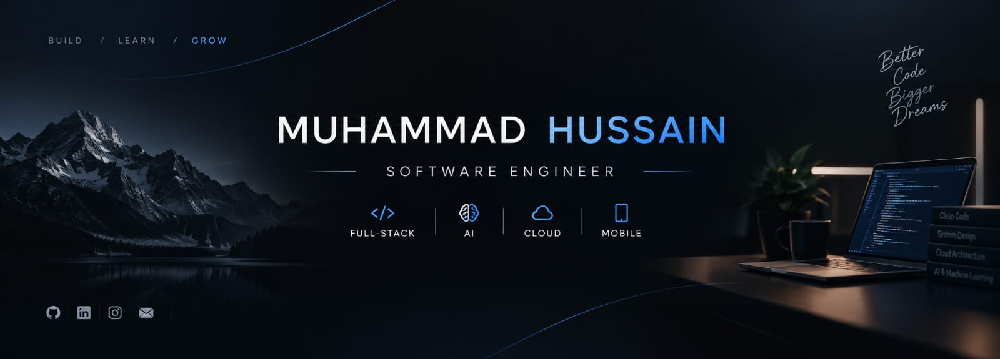

  

# Muhammad Hussain

### Software Engineer

**Full-Stack Development · React · Mobile · AI · Cloud**

I build modern software experiences with a strong focus on clean engineering, scalable architecture, responsive interfaces, and practical real-world applications.

  
  
  
  

---

## About

I am a Software Engineering student focused on building high-quality software across web, mobile, artificial intelligence, and cloud technologies.

My development approach combines strong programming fundamentals with modern engineering practices. I focus on writing maintainable code, creating responsive user experiences, and developing applications that solve practical problems.

---

## Core Expertise

### Languages
- JavaScript
- TypeScript
- Python
- C++
- HTML
- CSS

### Frontend Development
- React
- Responsive Web Development
- Modern UI Development
- Component-Based Architecture
- JavaScript / TypeScript

### Backend & APIs
- Node.js
- REST APIs
- Serverless Architecture
- Authentication
- Database Integration

### Mobile Development
- Mobile Application Development
- Cross-Platform Development
- API Integration
- Responsive Mobile Interfaces

### AI & Data
- Artificial Intelligence
- Machine Learning
- RAG Systems
- AI-Powered Applications
- Data Processing

### Databases & Backend Services
- SQL
- PostgreSQL
- Supabase
- Database Design
- Cloud Databases

### Cloud & DevOps
- Vercel
- Cloud Computing
- Deployment
- Git & GitHub
- CI/CD Fundamentals

### Tools
- Git
- GitHub
- VS Code
- npm
- REST APIs
- Modern Development Workflows

---

## Selected Projects

### 🤖 AI & Intelligent Applications

**DocuMind RAG System**  
A Retrieval-Augmented Generation system designed to interact with PDF documents and provide intelligent document-based responses.

**AI Voice Assistant**  
An AI-powered voice interaction application combining modern web technologies with intelligent conversational functionality.

---

### 💻 Full-Stack Applications

**Vellum — AI Resume Builder**  
A modern application designed to help users create professional resumes with AI-assisted functionality.

**Luxe Mart Pro**  
A modern e-commerce application focused on a polished shopping experience and responsive interface design.

**Foodora Elite**  
A food delivery web application featuring modern UI, product browsing, and an interactive ordering experience.

---

### 📱 Software & Mobile Applications

**Code Vault Max**  
A TypeScript-based software project focused on modern development practices and application architecture.

**GradeTrack Pro**  
A GPA calculation application supporting grading systems across multiple Pakistani universities.

---

## GitHub Analytics

  
  

---

## Current Focus

- Building production-quality web applications
- Full-stack development
- React and TypeScript
- Mobile application development
- Artificial Intelligence
- Cloud computing
- Software architecture
- Data structures and algorithms
- Continuous improvement through real-world projects

---

## Connect

I am interested in software engineering, full-stack development, artificial intelligence, cloud technologies, and building practical products.

  <a href="https://github.com/malikhussain9786-code">GitHub</a> ·
  <a href="https://www.linkedin.com/in/muhammad-hussain-5b5a71327">LinkedIn</a> ·
  <a href="mailto:malikhussain9786@gmail.com">Email</a> ·
  <a href="https://www.instagram.com/hussainxmalik">Instagram</a>

---

### Building. Learning. Engineering.

**Better Code · Bigger Dreams**
